# Store Rating App

A full-stack web application to **rate and review stores**, providing role-based dashboards for Admins, Store Owners, and Users. The app emphasizes **security, usability, and real-time interactivity**.

🔗 https://store-rating-app-omega.vercel.app
 
---

## **Project Overview**

The Store Rating App allows users to rate and review stores, while providing Admins and Store Owners with dashboards to manage users, stores, and ratings. It supports **role-based access control**, **secure authentication**, and ensures **data integrity**. The application is designed with **clean UI/UX**, responsive design, and interactive components like modals, dynamic search, and star ratings.

---

## **Features**

### **User Dashboard**
* View and submit ratings for stores.
* Filter and search stores by name, address, or email.
* Real-time star rating visualization.

### **Admin Dashboard**
* Manage users and stores.
* Add, update, and delete users or stores.
* View all ratings submitted by users.
* Role-based access ensures secure admin-only operations.

### **Store Owner Dashboard**
* View ratings for their stores.
* Track average ratings and total feedback.
* See detailed user reviews.

### **Common Features**
* Real-time search and filter.
* Dynamic modals for creating and updating data.
* Instant feedback using alerts and form validation.
* Responsive design for desktop and mobile devices.
* Interactive star rating display with glow effects according to rating.

---

## 🖼️ Screenshots

All screenshots are in the `screenshots/` folder.

### Authentication
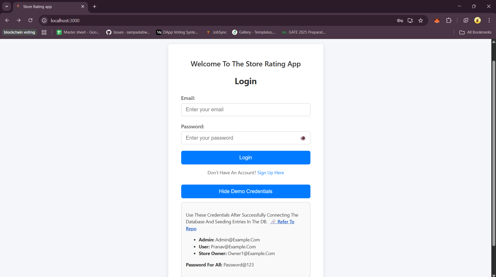 
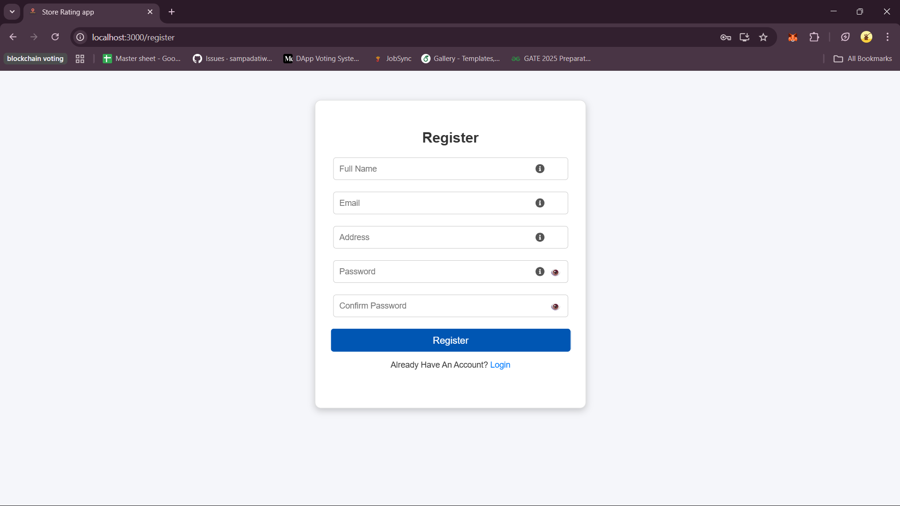

### User Dashboard
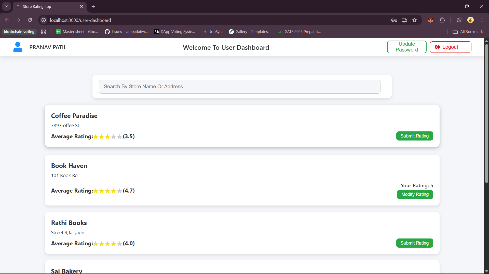
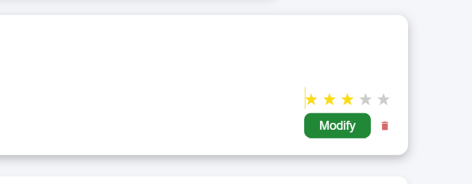
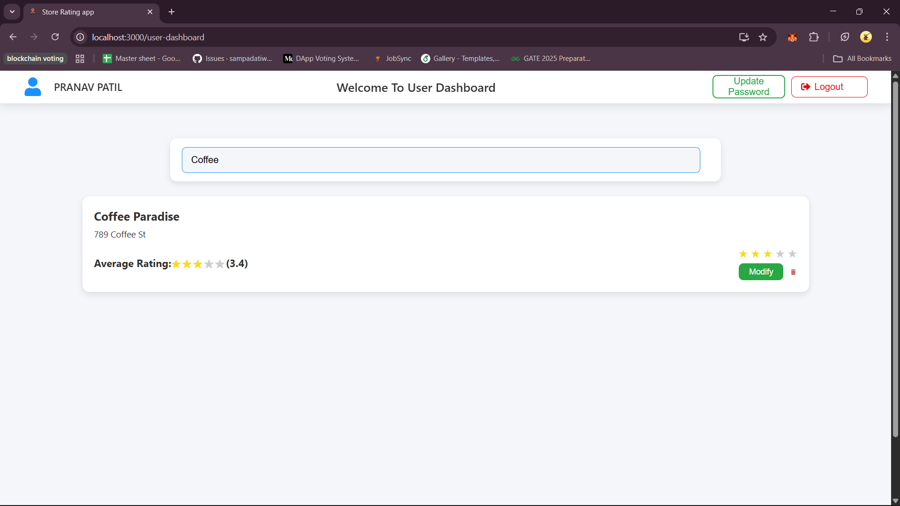

### Store Owner Dashboard
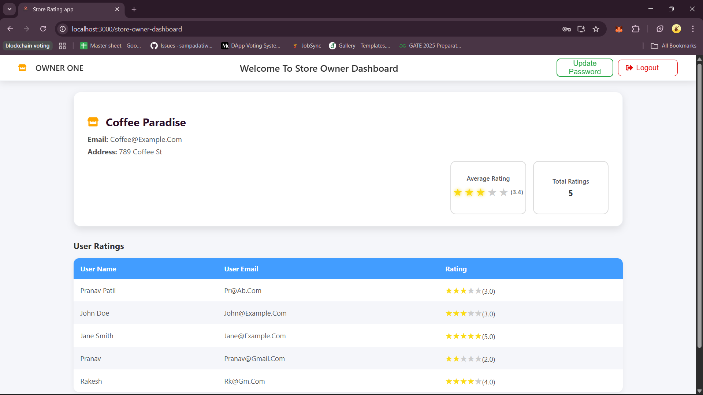

### Admin Dashboard
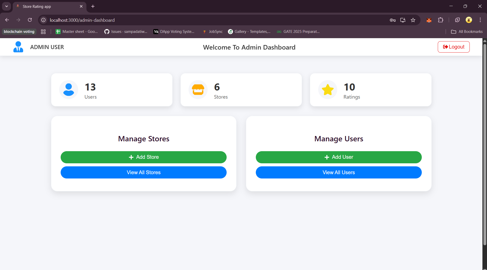

# User Management
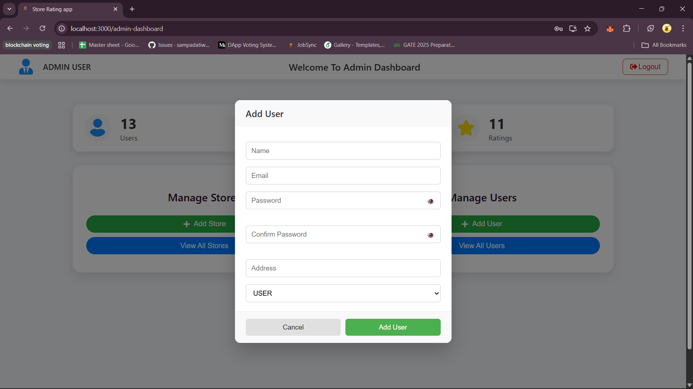
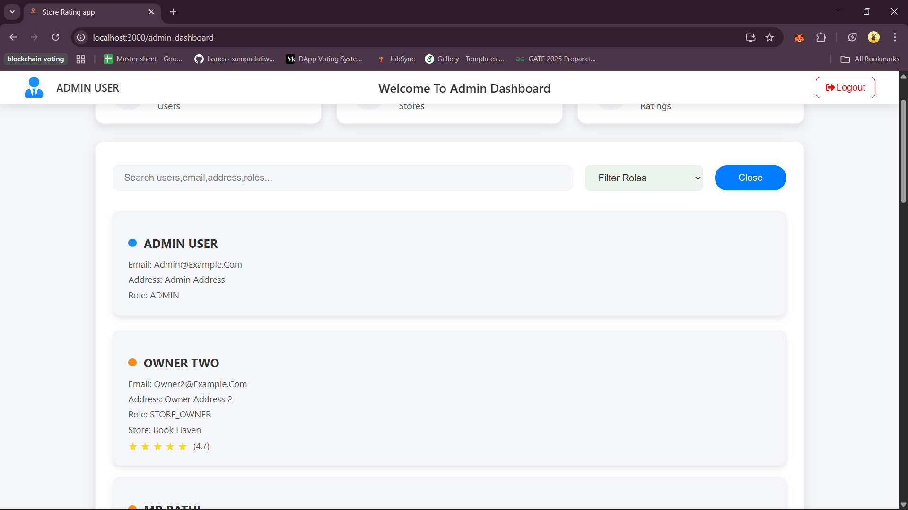

# Store Management
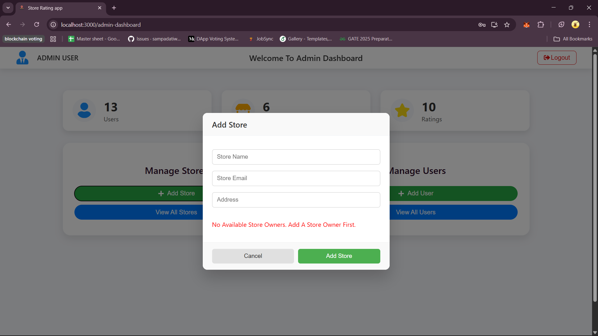
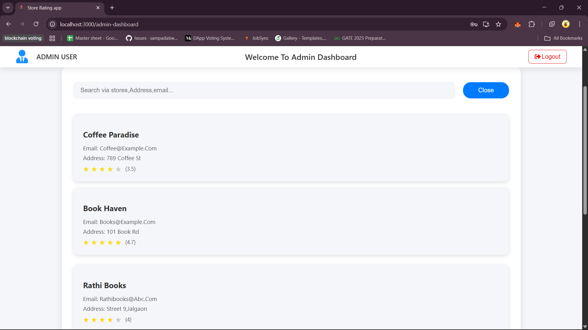

# Sreach/Filter using names,email,roles
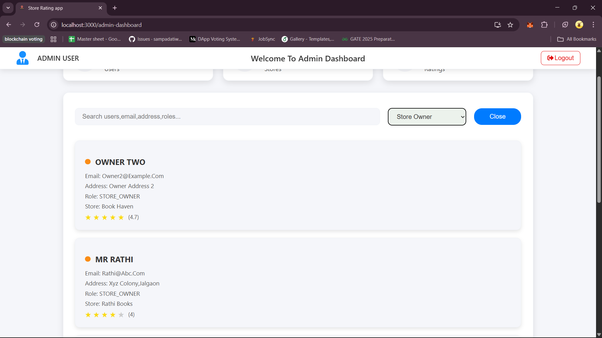


### Password Management
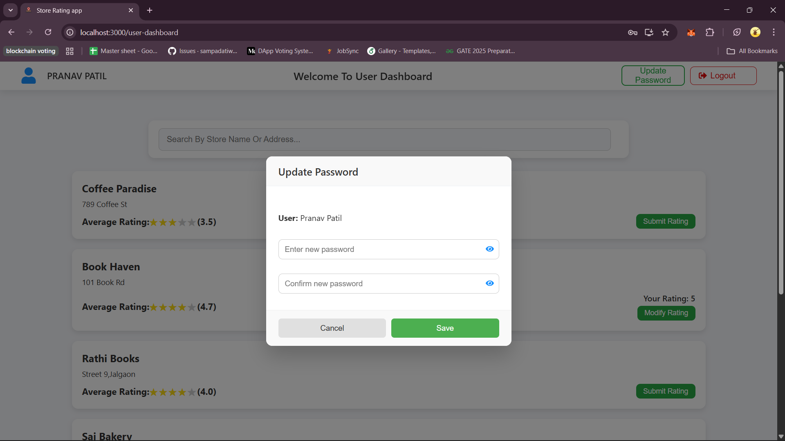

---

## **Tech Stack**

* **Frontend:** React.js, CSS, HTML, JavaScript
* **Backend:** Node.js, Express.js
* **Database:** PostgreSQL with Sequelize ORM
* **Authentication:** JWT (JSON Web Tokens)
* **Styling & UI:** React Icons, Modals, Alerts

---

## **Security Features**

1. **HTTP Headers Security**  
   * `helmet` middleware sets secure HTTP headers to protect against XSS, clickjacking, and MIME-sniffing.

2. **Cross-Origin Resource Sharing (CORS)**  
   * `cors` middleware allows only specific origins (`http://localhost:3000`), preventing unauthorized API requests.

3. **Rate Limiting**  
   * `express-rate-limit` limits `/auth` and `/ratings` routes to 100 requests per 15 minutes to mitigate brute force attacks.

4. **Authentication & Authorization**  
   * JWT Authentication ensures protected routes are accessible only to authenticated users.  
   * Role-based access control (RBAC) restricts admin-only operations.

5. **Password Security**  
   * `bcrypt` password hashing for storing passwords securely.  
   * Strong password validation with regex during registration and updates.

6. **Input Validation**  
   * Password length and complexity checks.  
   * Ratings must be between 1–5.  
   * Store creation validates required fields.

7. **Duplicate Prevention & Unique Constraints**  
   * Database-level unique constraints on store emails and user/store rating combinations.

8. **Error Handling**  
   * Returns appropriate HTTP status codes: 400, 401, 403, 404, 429, 500.  
   * Prevents sensitive information leakage.

9. **Secure JWT Usage**  
   * Tokens signed with `process.env.JWT_SECRET` and expire in 1 hour.

10. **Data Integrity / Referential Security**  
    * Sequelize relationships with `onDelete: "CASCADE"` to prevent orphaned records.

11. **Database Connection Security**  
    * Database credentials stored in environment variables (`.env`) to avoid hardcoding sensitive info.

---

### ⚙️ Setup & Installation


### 1) Clone the Repository
```bash
git clone https://github.com/pranavpatil005/Store-Rating-App.git
cd Store-Rating-App
```

### 2) Backend Setup

**Step 1:** Navigate to backend
```bash
cd backend
```

**Step 2:** Install dependencies
```bash
npm install
```

**Step 3:** Start development server
```bash
npm run dev
```
You should see this in green color:
```
[nodemon] clean exit - waiting for changes before restart
```
Now open Pgadmin to setup the Databaase

### 3) Database Setup (pgAdmin)

> **Note:** The `.env` file is already present in the repo. Before starting, check the `DATABASE_URL` for the correct `user`, `password`, and `database` name.

you will need Pgadmin for this so install it and setup if you haven't.

1. Open pgAdmin and right click on "Databases" → Create → database  
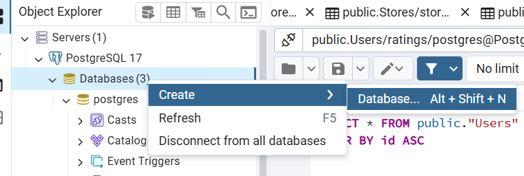

2. Assign owner (your username from `.env`) (by default it should be ratings_user)
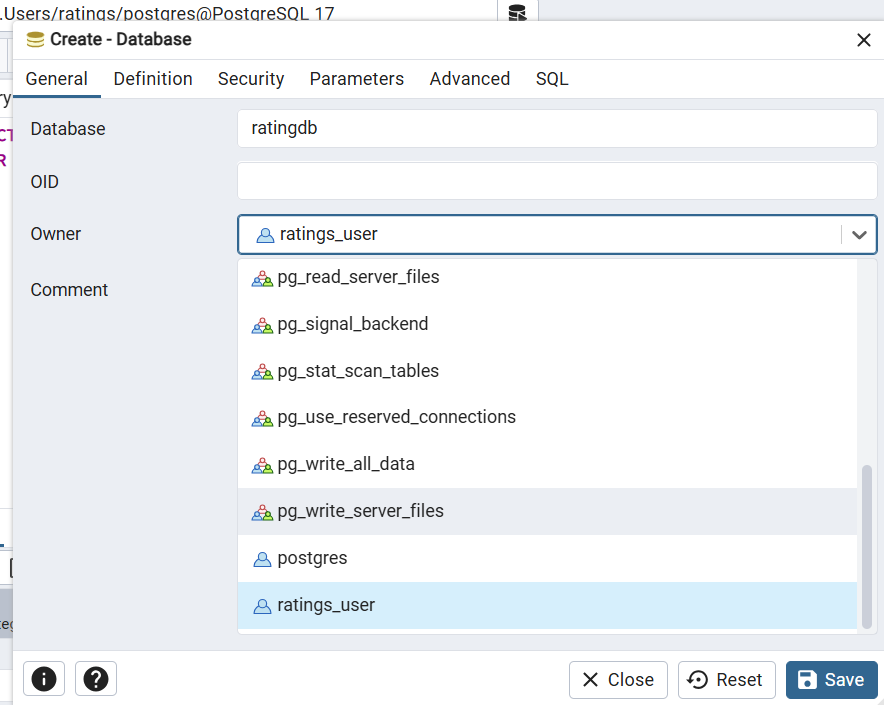

3. Verify DB name matches `.env`  (by default it should be ratingdb)
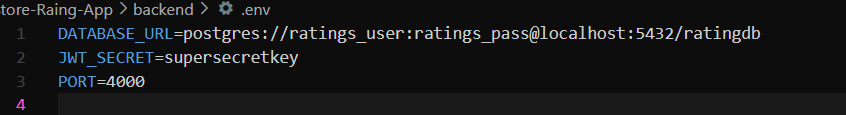

4. Go to backend terminal where you saw the green line  → type `rs`.
click enter .

if you followed correctly then you should see:
```
✅ All models synced with database
🚀 Server running on http://localhost:4000
```

5. Seed demo data in new terminal:
(This step is to add some demo users and stores in the database for trail.)
```bash
cd backend
node src/seed.js
```
Output if everything goes right:
```
✅ Database synced. Seeding...
✅ Seeding completed successfully.
```
This means trail data has been added in the database.

6. Verify tables in pgAdmin.

Go to your database and right click then click refresh 
click the dropdown,then  → `Schemas → public → Tables`  
you should see 3 tables:
Tables: **Ratings, Stores, Users**  
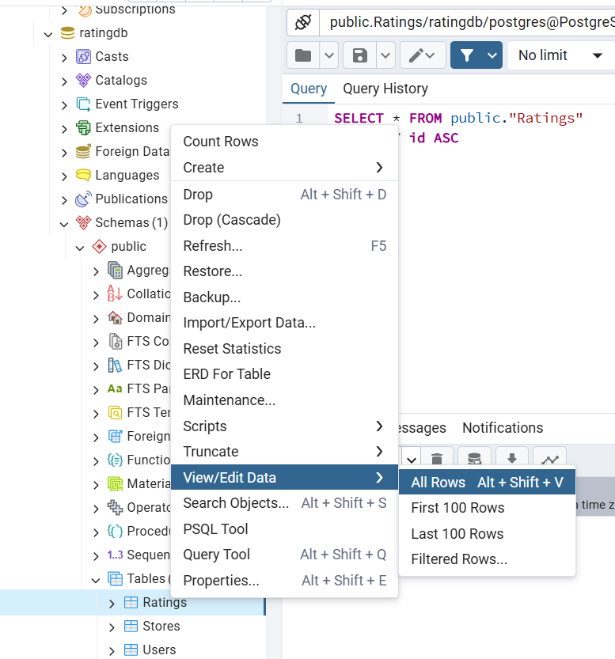

click on any table and then click View/Edit Data.
you should see few entries in the table.
This means our app is ready to work.

### 4) Frontend Setup

**Step 1:** Start a new terminal 
Navigate to frontend
```bash
cd frontend
```

**Step 2:** Install dependencies
```bash
npm install
```

**Step 3:** Start frontend server
```bash
npm start
```
It should Open in browser: [http://localhost:3000](http://localhost:3000)  
Login using demo credentials or register a new user.

---

## 📬 Contact

- Email: patilpranav2368@gmail.com  
- LinkedIn: [Pranav Patil](https://www.linkedin.com/in/pranavpatil1705)

---
